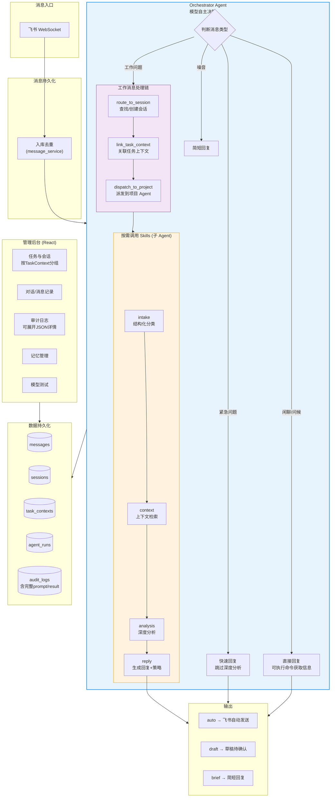

# Personal Work Agent OS

Local-first 个人工作助理系统。接入飞书，由 Orchestrator Agent 自主决策处理每条消息 — 分类、路由、分析、回复。依托 Claude Code Agent SDK，模型驱动的 Agentic 架构。

## 系统流程



## 已实现功能

### Phase 1-5: 基础架构（已完成）

| 能力 | 实现方式 | 状态 |
|------|----------|------|
| 飞书消息接入 | WebSocket 长连接 + 去重入库 | ✅ |
| Orchestrator Agent | 单入口，模型自主决策处理路径 | ✅ |
| 5 个子 Agent | intake/context/analysis/reply/report | ✅ |
| MCP 工具 | 12 个 tool（DB查询、飞书发送、会话路由等） | ✅ |
| 管理后台 | React + Vite（消息/会话/审计/记忆/模型测试） | ✅ |
| 数据库模型 | 8 张表（messages, sessions, task_contexts 等） | ✅ |
| API 服务 | FastAPI，20+ 端点 | ✅ |

### Phase 6: 多轮对话与会话路由（已完成）

| 能力 | 实现方式 | 状态 |
|------|----------|------|
| 会话路由 | `route_to_session` — chat_id + 项目 + 2h 时间窗口匹配 | ✅ |
| 多轮上下文注入 | pipeline 代码层面强制 session 路由（chat_id + 2h 窗口），注入 prompt | ✅ |
| 任务上下文自动创建 | pipeline 处理后自动创建 task_context 并关联 session | ✅ |
| Agent Session Resume | `agent_session_id` 绑定到 DB session，dispatch 时可恢复 | ✅ |
| 项目派发 | `dispatch_to_project` — 在项目目录下启动子 Agent 执行 | ✅ |
| 多 provider 模型路由 | Anthropic + OpenAI，fallback 自动切换 | ✅ |
| 审计日志增强 | pipeline_agent_call/result 记录完整 prompt 和输出 | ✅ |

### Phase 7: 可观测性与模型切换（已完成）

| 能力 | 实现方式 | 状态 |
|------|----------|------|
| 运行时模型切换 | 飞书 `/m <model_id>` 命令 + 管理后台 API | ✅ |
| 任意模型 ID 支持 | 不在 models.yaml 中的模型自动推断 provider | ✅ |
| 全局模型切换器 | 管理后台顶栏下拉 — 搜索/选择/自定义输入 | ✅ |
| Agent Run 可观测 | inflight 查询 + 历史记录 API（含 cost/duration） | ✅ |
| dispatch 追踪 | dispatch_to_project 独立 AgentRun 生命周期 | ✅ |
| 多轮 resume 精简 | 有 agent_session_id 时 prompt 只传新消息 | ✅ |
| dispatch 回写 project | 成功后 project 写回 session，后续消息自动关联 | ✅ |
| Scheduler 修复 | AsyncIOScheduler event loop bug 修复 | ✅ |
| 审计日志增强 | pipeline_agent_call/result 记录完整 prompt 和输出 | ✅ |

## 架构

```
.claude/agents/          子 Agent 定义（唯一定义源）
├── intake.md            消息分类
├── context.md           上下文检索
├── analysis.md          深度分析
├── reply.md             回复生成
└── report.md            日报生成

apps/
├── api/                 FastAPI 服务 + 管理 API
├── worker/
│   ├── feishu_worker    飞书 WebSocket 长连接
│   └── scheduler        定时任务（监控/日报/记忆）
└── admin-ui/            React + Vite 管理后台

core/
├── pipeline.py          Orchestrator Agent 入口
├── projects.py          项目注册与发现
├── monitor.py           任务进度监控（纯 DB 查询）
├── connectors/
│   ├── feishu.py        飞书 SDK 封装
│   └── message_service  消息入库 + 触发 pipeline
├── orchestrator/
│   ├── agent_client.py  Agent SDK 客户端 + 12 个 MCP 工具
│   └── claude_client.py 多 provider 模型路由
├── sessions/            路由/摘要/生命周期
├── reports/             日报生成
└── memory/              长期记忆归档

data/
├── models.yaml          多模型配置
├── projects.yaml        项目注册
tests/
└── test_multiturn_session.py  多轮会话 e2e 测试（7 项检查点）
```

## 快速开始

```bash
# 1. 安装依赖
pip install -e .

# 2. 配置环境变量
cp .env.example .env
# 编辑 .env 填入 FEISHU_APP_ID, FEISHU_APP_SECRET, ANTHROPIC_API_KEY

# 3. 初始化数据库
python scripts/init_db.py

# 4. 启动服务
python -m apps.worker.feishu_worker  # 飞书消息接收
python -m uvicorn apps.api.main:app --port 8000  # API 服务
cd apps/admin-ui && npm install && npm run dev  # 管理后台

# 5. 运行测试
pytest tests/test_multiturn_session.py -v
```

## API 端点

| 端点 | 说明 |
|------|------|
| `GET /api/conversations` | 对话记录（问答配对） |
| `GET /api/conversations/{chat_id}/history` | 聊天历史 |
| `GET /api/messages` | 原始消息列表 |
| `GET /api/sessions` | 工作会话列表 |
| `GET /api/sessions/{id}` | 会话详情 + 消息 + 摘要 |
| `GET /api/task-contexts` | 任务上下文（含关联会话） |
| `GET /api/memory/files` | 记忆文件列表 |
| `GET/PUT/DELETE /api/memory/files/{path}` | 记忆文件 CRUD |
| `GET /api/audit-logs` | 审计日志 |
| `GET /api/models` | 模型配置（含 current/override） |
| `POST /api/model/switch` | 运行时模型切换 |
| `GET /api/agent-runs` | Agent 执行历史 |
| `GET /api/agent-runs/inflight` | 当前运行中的 Agent |
| `GET /api/stats` | 统计概览 |
| `POST /api/messages/{id}/reprocess` | 重新处理消息 |
| `POST /api/playground/chat` | 模型测试对话 |

---

## 下阶段计划

### Phase 8: 飞书话题会话跟踪 ✅

**目标**: 用飞书话题（Thread）替代时间窗口，实现精确的多轮会话关联。

**已完成**:

- [x] 解析飞书消息中的 `thread_id` / `root_id` / `parent_id` 字段，入库存储
- [x] Bot 回复使用 `reply_in_thread=true` 自动创建话题，`thread_id` 回写到 Session
- [x] Session 路由：有 `thread_id` 精确匹配，无 `thread_id` 新建（移除 chat_id + 时间窗口猜测）
- [x] 新增 `reply_to_message` MCP tool，替代 `send_feishu_message` 用于回复
- [x] 移除 `route_to_session` MCP tool，session 路由完全由 pipeline 代码层处理
- [x] SDK session resume：有 `agent_session_id` 时传入 `session_id` 恢复上下文
- [x] 精简 prompt：resume 时只传新消息 + 必要 ID，首次也只传核心信息
- [ ] 管理后台按话题维度展示会话

### Phase 9: 飞书消息增强

**目标**: 支持图片消息、卡片消息，提升消息展示质量。

- [ ] 支持图片消息接收（解析 image 类型，下载图片，传给多模态模型处理）
- [ ] 支持图片消息回复（Agent 生成的图片/截图可通过飞书发送）
- [ ] 支持飞书卡片消息（Interactive Card）回复
- [ ] 回复区分：正文、分析过程、风险提示（卡片分块）
- [ ] 支持文件消息接收
- [ ] 草稿消息支持飞书卡片确认按钮

### Phase 10: 管理后台增强

**目标**: 日常可用的监控和运营界面。

- [ ] 消息/会话搜索（关键词、发送者、时间范围）
- [ ] Dashboard Token 消耗折线图 + 消息分类饼图
- [ ] 手动修正消息分类和会话归属
- [ ] 草稿消息审批界面
- [ ] 日报预览和编辑

### Phase 11: 稳定性与部署

**目标**: 生产可用。

- [ ] Docker Compose 一键部署
- [ ] Token 消耗日预算告警
- [ ] SQLite 每日自动备份
- [ ] 将 consolidator/summary 迁移到 Agent SDK 架构
