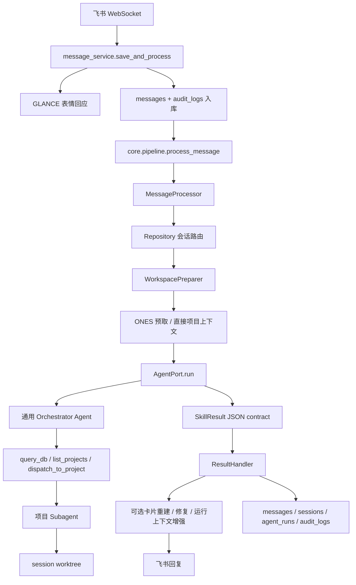

# Work Agent OS

本地优先的飞书工作助理系统。系统会接收飞书消息、入库、准备会话级 workspace，让 Agent 判断处理方式，最后由 core adapter 统一完成飞书回复、数据库写入、审计记录和会话状态更新。

当前支持两种 Agent runtime：

- `claude`：Claude Code Agent SDK / Claude CLI
- `codex`：Codex CLI + 本地 MCP server

## 运行链路



关键边界：

- Agent 不直接发送飞书消息。
- Agent 不直接保存 bot reply。
- core 负责 workspace、附件 staging、session patch、回复发送、审计记录和状态更新。
- 项目级工作通过 `dispatch_to_project` 下沉到项目 subagent，subagent 的 cwd 由系统指定为该项目的 session worktree。

## 目录结构

```text
apps/
  api/                 FastAPI 应用和管理 API
  worker/              飞书 WebSocket worker 和 scheduler
  admin-ui/            React/Vite 管理后台

core/
  pipeline.py          公共入口：process_message / reprocess_message
  app/                 消息处理 use case 与结果处理
  artifacts/           会话 workspace、附件 staging、skill registry
  connectors/          飞书与消息入库 adapter
  orchestrator/        Agent runtime、MCP tools、项目 dispatch
  projects.py          项目注册、skill 合并、git worktree runtime context
  sessions/            会话路由、生命周期、摘要
  memory/              结构化记忆与归档
  reports/             日报生成

models/
  db.py                SQLModel 数据库模型

.claude/
  agents/              本仓库使用的 Claude subagent 定义
  skills/              workflow skill 定义

data/
  projects.yaml        可 dispatch 的项目注册表
  models.yaml          模型/runtime 配置
  db/app.sqlite        初始化后的本地 SQLite 数据库
  sessions/            会话级 workspace 和运行产物

tests/
  baseline/            public pipeline contract 测试
  test_*               单元测试与集成测试
```

运行产物按 session 隔离。以 `session-152` 为例：

```text
data/sessions/session-152/
  workspace/
    input/             message/session/history/media/project workspace
    state/             runtime state
    output/            final contract 和 summary
    artifacts/         当前运行 staging 产物
  .ones/               ONES intake 产物
  .triage/             日志排障产物
  .review/             GitLab review 产物
  worktrees/           项目 worktree：<project>/<task-version>
  project_workspace.json
  uploads/             飞书媒体下载文件
  attachments/         解压或人工整理后的附件
  scratch/             临时文件
```

不要把运行时分析产物写到仓库根目录的 `.ones`、`.triage`、`.review` 或 `.session`。所有路径应从 `workspace/input/artifact_roots.json` 读取。

## 项目 Workspace

会话目录骨架由 `core/artifacts/session_init.py` 初始化；Agent 和 skill 只在已初始化的 roots 下追加文件。

项目工作区由 `core/app/project_workspace.py` 管理。每个 session 都会有：

```text
data/sessions/<session>/project_workspace.json
data/sessions/<session>/workspace/input/project_workspace.json
```

`project_workspace.projects` 是当前 session 的多项目注册表。每个项目 entry 记录：

- `source_path/project_path`：源仓库登记位置，只用于识别。
- `worktree_path/execution_path`：实际分析和修改目录。
- 版本、checkout_ref、branch/tag、commit 元信息。
- 加载原因和 worktree 决策说明。

对于 ONES、直接项目上下文或按需加载的问题，系统会：

- 读取 `data/projects.yaml` 中注册的项目。
- 读取 git 当前分支、commit、describe 等元信息。
- 从 ONES 结果或当前仓库中提取版本线索。
- 匹配 tag 或 branch。
- 在 session 的 worktree 根目录下创建或复用 detached worktree。

worktree 路径规则：

```text
data/sessions/<session>/worktrees/<project>/<task-number>-<task-uuid>-<version>
```

无 ONES 版本线索时，会为当前分支/版本创建 `current-*` worktree。系统不再写单项目兼容文件 `project_runtime_context.json`。

## 项目 Dispatch

Orchestrator 当前暴露这些工具：

- `query_db`：只读 SQL 查询。
- `list_projects`：列出 `data/projects.yaml` 注册项目。
- `prepare_project_worktree`：把指定项目加载到当前 session worktree 并写入 `project_workspace.json`。
- `dispatch_to_project`：在指定项目上下文中运行项目 subagent。

`dispatch_to_project` 会合并全局和项目本地 skill，构建 project workspace prompt block，并调用 `agent_client.run_for_project()`，其中 `project_cwd` 使用该项目的 session worktree。

跨项目工作的设计原则：

- 主 Agent 判断下一步属于哪个项目。
- core 准备或复用该项目 session worktree。
- 项目 subagent 只在分配给它的 `worktree_path/execution_path` 中工作。
- 主 Agent 汇总多个项目 subagent 的结果。

## Workflow Skills

workflow skill 位于 `.claude/skills/*/SKILL.md`，由 `core/skill_registry.py` 自动发现。

当前重点 skill：

- `ones`：下载和标准化 ONES 工单、评论、图片、附件和 `summary_snapshot`。
- `riot-log-triage`：RIOT/FMS/allspark 日志和现场问题排障，产出 state、DSL、keyword package 和 search runs。
- `gitlab-issue-review`：GitLab issue/MR 上下文收集、review 状态和确认后评论发布。
- `feishu_card_builder`：把结构化摘要渲染成飞书卡片 contract。
- `daily-report`：从会话数据生成日报。

## 启动服务

```bash
# 安装 Python 包
pip install -e .

# 初始化数据库
python scripts/init_db.py

# 飞书 worker
python -m apps.worker.feishu_worker

# API 服务
python -m uvicorn apps.api.main:app --port 8000

# 定时任务
python -m apps.worker.scheduler

# 管理后台
cd apps/admin-ui
npm install
npm run dev

# Windows 一键重启
cmd /c scripts\restart_all_windows.bat
```

## 配置

主要环境变量：

```text
FEISHU_APP_ID
FEISHU_APP_SECRET
FEISHU_BOT_NAME
FEISHU_REPORT_CHAT_ID

ANTHROPIC_API_KEY
ANTHROPIC_AUTH_TOKEN
ANTHROPIC_BASE_URL

OPENAI_API_KEY
OPENAI_BASE_URL

DEFAULT_AGENT_RUNTIME      claude 或 codex
CODEX_EXEC_TIMEOUT_SECONDS

ENABLE_MEMORY_TOOLS
ENABLE_MEMORY_CONSOLIDATION

DATABASE_URL
GITLAB_TOKEN
GITLAB_PROJECT_URL
```

模型配置在 `data/models.yaml`。可以通过飞书 `/m <model_id>` 命令或管理后台切换模型。runtime/model override 会持久化到 `app_settings` 表。

项目路由候选在 `data/projects.yaml`。项目目录下如果存在 `.claude/agents/*.md` 或 `.claude/skills/*/SKILL.md`，项目 subagent 运行时会合并这些本地能力。

## API 面

管理 API 挂载在 `/api`，实现位于 `apps/api/routers/admin.py`。主要包含：

- messages / conversations
- sessions / task contexts
- audit logs / agent runs
- model 和 runtime 切换
- memory entries
- triage/review 运行产物浏览
- project insights
- playground chat

## 测试

快速 contract 测试：

```bash
pytest tests/baseline -q
```

core 相关改动常用测试：

```bash
pytest tests/test_ones_routing.py tests/test_direct_project_context.py tests/test_dispatch_to_project.py -q
pytest tests/test_reply_enrichment.py tests/test_service_runtime.py tests/test_multimodal_attachments.py -q
pytest tests/test_gitlab_issue_review_scripts.py tests/test_gitlab_review_publish_script.py -q
pytest tests/test_riot_log_triage_scripts.py tests/test_riot_log_triage_replay_case.py -q
```

真实 API 路由集成测试：

```bash
pytest tests/test_e2e_routing.py -v -s -m e2e
```

前端：

```bash
cd apps/admin-ui
npm run build
npm run lint
```

## 工程备注

- `core/pipeline.py` 是公共消息处理入口。
- `core/app/message_processor.py` 是主 use case 编排。
- `WorkspacePreparer` 每轮都会重建当前 workspace input 和 session artifact root map。
- `ResultHandler` 负责回复校验、可选修复、上下文增强和发送。
- 飞书媒体先由 `message_service` 下载，再由 `MediaStager` staging 到当前 workspace。
- 内部 MCP/tool 错误不能直接作为用户可见回复透传。
- GitLab review 评论必须在用户明确确认后才发布。
