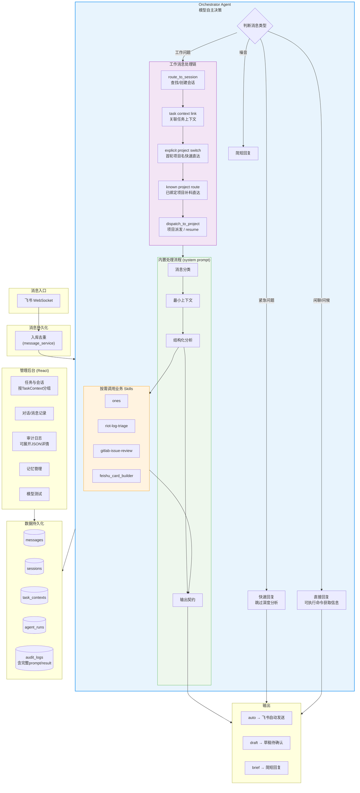

# Personal Work Agent OS

Local-first 个人工作助理系统。接入飞书，由 Pipeline + Agent runtime 自主处理每条消息：分类、路由、分析、回复。当前同时支持 `claude` 与 `codex` 两种运行时，并通过本地 MCP 工具读取数据库、派发项目 Agent 和执行 GitLab review 工作流；飞书投递与 DB 写入由 core adapter 统一处理。

## 系统流程



## 已实现功能

> 当前主线阶段能力已基本完成。下面的 Phase 1-9 主要用于回顾已落地里程碑，不再表示项目仍卡在某个阶段；文末只保留少量“后续增强项”作为非阻塞优化方向。

### Phase 1-5: 基础架构（已完成）

| 能力 | 实现方式 | 状态 |
|------|----------|------|
| 飞书消息接入 | WebSocket 长连接 + 去重入库 | ✅ |
| Orchestrator Agent | 单入口，模型自主决策处理路径 | ✅ |
| 内置消息流程 | intake/context/analysis 已进入 system prompt；workflow skills 按业务场景触发 | ✅ |
| MCP 工具 | 只暴露 DB 只读查询、项目派发和可选只读记忆检索；平台副作用由 core 处理 | ✅ |
| 管理后台 | React + Vite（消息/会话/审计/记忆/模型测试） | ✅ |
| 数据库模型 | 8 张表（messages, sessions, task_contexts 等） | ✅ |
| API 服务 | FastAPI，20+ 端点 | ✅ |

### Phase 6: 多轮对话与会话路由（已完成）

| 能力 | 实现方式 | 状态 |
|------|----------|------|
| 会话路由 | `route_to_session` — chat_id + 项目 + 2h 时间窗口匹配 | ✅ |
| 多轮上下文注入 | pipeline 代码层面强制 session 路由（chat_id + 2h 窗口），注入 prompt | ✅ |
| 任务上下文自动创建 | pipeline 处理后自动创建 task_context 并关联 session | ✅ |
| Agent Session Resume | `agent_session_id` 绑定到 DB session，dispatch 时可恢复 | ✅ |
| 项目派发 | `dispatch_to_project` — 在项目目录下启动子 Agent 执行 | ✅ |
| 多 provider 模型路由 | Anthropic + OpenAI，fallback 自动切换 | ✅ |
| 审计日志增强 | pipeline_agent_call/result 记录完整 prompt 和输出 | ✅ |

### Phase 7: 可观测性与模型切换（已完成）

| 能力 | 实现方式 | 状态 |
|------|----------|------|
| 运行时模型切换 | 飞书 `/m <model_id>` 命令 + 管理后台 API | ✅ |
| 任意模型 ID 支持 | 不在 models.yaml 中的模型自动推断 provider | ✅ |
| 全局模型切换器 | 管理后台顶栏下拉 — 搜索/选择/自定义输入 | ✅ |
| Agent Run 可观测 | inflight 查询 + 历史记录 API（含 cost/duration） | ✅ |
| dispatch 追踪 | dispatch_to_project 独立 AgentRun 生命周期 | ✅ |
| 多轮 resume 精简 | 有 agent_session_id 时 prompt 只传新消息 | ✅ |
| dispatch 回写 project | 成功后 project 写回 session，后续消息自动关联 | ✅ |
| Scheduler 修复 | AsyncIOScheduler event loop bug 修复 | ✅ |
| 审计日志增强 | pipeline_agent_call/result 记录完整 prompt 和输出 | ✅ |
| 飞书话题会话 | thread_id 精确匹配，reply_in_thread 自动创建话题 | ✅ |
| 消息表情回应 | 收到消息立即 GLANCE 回应，表示已收到 | ✅ |
| 多模态消息解析 | image/file/video/audio/post/interactive/sticker 全类型 | ✅ |
| 处理进度通知 | 话题内持续推送累计思考时间，不盲目重试 | ✅ |
| 内部工具错误脱敏 | `user cancelled MCP tool call` 等内部文本不再直接发给用户 | ✅ |
| 首轮项目切换快速路径 | `allspark 项目` / `切到 allspark` 这类短消息直接进入项目 Agent | ✅ |
| 已知项目补料直达 | session 已绑定 project 但还没有 `agent_session_id` 时，补料消息直接进入项目 Agent | ✅ |
| Review 工作区分流 | GitLab issue/MR review 过程与失败记录默认写入 `.review/` | ✅ |
| GitLab Review Workflow | 支持 issue/MR 上下文抓取、review 状态流、正式评论发布脚本 | ✅ |
| Feishu WS 自动重连 | WebSocket 断开后自动重连，不需要人工重启 worker | ✅ |
| Scheduler 监控健壮性 | `monitor_job` 不再依赖 `counts["stuck"]` 必存在 | ✅ |

### Phase 8: 飞书话题会话跟踪（已完成）

**目标**: 用飞书话题（Thread）替代时间窗口，实现精确的多轮会话关联。

- [x] 解析飞书消息中的 `thread_id` / `root_id` / `parent_id` 字段，入库存储
- [x] Bot 回复使用 `reply_in_thread=true` 自动创建话题，`thread_id` 回写到 Session
- [x] Session 路由：有 `thread_id` 精确匹配，无 `thread_id` 新建
- [x] 飞书回复由 channel adapter 统一处理，并自动创建/续接话题
- [x] Session 路由完全由 pipeline 代码层处理（移除 `route_to_session` tool）
- [x] SDK session resume：有 `agent_session_id` 时传入 `session_id` 恢复上下文
- [x] 精简 prompt：resume 时只传新消息 + 必要 ID

### Phase 9: 飞书消息体验增强（核心链路已完成）

**已完成**:

- [x] 收到消息立即 GLANCE（👀）表情回应，表示已收到
- [x] 多模态消息解析：image / file / video / audio / post / interactive / sticker
- [x] Pipeline prompt 携带 `[多模态内容]` 描述，Agent 可感知媒体类型
- [x] 图片与文件附件下载：收到 image / file / post 图片时自动下载到本地工作目录
- [x] 处理进度通知：模型思考中每 5 分钟在话题内推送累计时间（5min/10min/15min...）
- [x] 智能重试：仅在 agent_run 明确失败时重试，超时不重试
- [x] 项目注册：allsparkbox（RIOT3 部署构建包）
- [x] 内部工具错误脱敏，避免把 MCP/tool 取消信息直接回给用户
- [x] 首轮短消息显式项目切换快速直达
- [x] GitLab review 首轮流程落盘到 `.review/`

## 架构

```
.claude/agents/          子 Agent 定义
.claude/skills/          业务 workflow skills（唯一业务 skill 根目录）

apps/
├── api/                 FastAPI 服务 + 管理 API
├── worker/
│   ├── feishu_worker    飞书 WebSocket 长连接
│   └── scheduler        定时任务（监控/日报/记忆）
└── admin-ui/            React + Vite 管理后台

core/
├── pipeline.py          public facade：process_message / reprocess_message
├── app/                 消息处理 use case 编排
├── agents/              Agent runtime adapter
├── artifacts/           workspace / media manifest
├── repositories.py      DB 读写
├── projects.py          项目注册与发现
├── monitor.py           任务进度监控（纯 DB 查询）
├── connectors/
│   ├── feishu.py        飞书 SDK 封装
│   └── message_service  消息入库 + 触发 pipeline
├── orchestrator/
│   ├── agent_client.py  Agent runtime 客户端（Claude / Codex）
│   ├── codex_runtime.py Codex CLI exec / stream adapter
│   ├── tools.py         MCP 工具定义与工具作用域
│   ├── hooks.py         Claude SDK hook
│   └── claude_client.py 多 provider 模型路由
├── sessions/            路由/摘要/生命周期
├── reports/             日报生成
└── memory/              长期记忆归档

.claude/skills/
├── ones/                ONES intake workflow（含 routing/intake/ones_cli 脚本）
├── riot-log-triage/     RIOT 日志/现场问题分析 workflow
├── feishu_card_builder/ 结构化摘要输出 + Markdown / Feishu card payload 渲染
├── daily-report/        每日工作会话汇总与日报生成
└── gitlab-issue-review/ GitLab review workflow

data/
├── models.yaml          多模型配置
├── projects.yaml        项目注册
.review/                 GitLab issue/MR review 工作目录（运行时生成）
.triage/                 日志/现场问题分析工作目录（运行时生成）
tests/
├── baseline/                  公共 pipeline contract 测试
├── test_e2e_routing.py        核心能力集成测试 — 真实 API，路由一致性验证（约5分钟）
├── test_gitlab_issue_review_scripts.py
└── test_gitlab_review_publish_script.py
```

## GitLab Review Workflow

仓库内置了 `.claude/skills/gitlab-issue-review/`，用于处理 GitLab issue / MR review 场景。

当前能力包括：

- 首轮 GitLab review 过程记录默认写入 `.review/`
- `glab` 优先抓取 issue / MR / notes
- 多分支 cherry-pick 等价归并
- `bugfix / feature / mixed` 变更意图识别
- 固定 `format=rich` 输出契约
- 只有在用户明确确认后，才允许正式发布 MR 行评论

关键脚本：

```bash
python .claude/skills/gitlab-issue-review/scripts/init_review.py --project allspark --issue-url <issue-url>
python .claude/skills/gitlab-issue-review/scripts/collect_issue_context.py --issue-url <issue-url> --state .review/<case>/00-state.json
python .claude/skills/gitlab-issue-review/scripts/publish_review_comments.py --state .review/<case>/00-state.json --mr-iid <iid> --confirmed
```

## 当前重点 Workflow Skills

当前项目已经形成几个重点工作流型 skill：

- `ones` 问题分析
  - 用于 ONES 工单下载、评论/附件补齐、现场证据收集、版本线索识别与问题分析
  - 当前已经整合到 `.claude/skills/ones/`
  - 本地脚本已随仓库维护：`.claude/skills/ones/scripts/ones_cli.py`、`routing.py`、`intake.py`
  - 标准产物落在 `.ones/<task-number>_<task-uuid>/`，核心包括 `task.json`、`messages.json`、`desc_local.md`、`summary_snapshot.json`
  - 适合日志类、现场类、工单类问题
- `feishu_card_builder`
  - 只负责把结构化业务结论整理成结构化摘要，并渲染成 Markdown 或 `feishu_card` payload
  - 不直接发送飞书、不写 DB；发送仍由 core channel adapter 统一处理
- `daily-report`
  - 汇总前一日工作会话、摘要、待办与风险，生成结构化日报
- `gitlab-issue-review`
  - 用于 GitLab issue / MR 上下文抓取、代码 review、风险判断、正式 MR 评论发布
  - 适合问题修复 review、新功能 review、多分支 cherry-pick 归并

这些 workflow skill 已经是当前项目的主要工作面，后续会继续扩展更多工作流能力，例如：

- 记忆系统深度集成
- review / triage 结果自动沉淀到结构化记忆
- 更多项目专用 workflow skill
- 更强的飞书卡片化输出和审批流

## 快速开始

```bash
# 1. 安装依赖
pip install -e .

# 2. 配置环境变量
cp .env.example .env
# 编辑 .env 填入 FEISHU_APP_ID, FEISHU_APP_SECRET, ANTHROPIC_API_KEY

# 3. 初始化数据库
python scripts/init_db.py

# 4. 启动服务
python -m apps.worker.feishu_worker  # 飞书消息接收
python -m uvicorn apps.api.main:app --port 8000  # API 服务
python -m apps.worker.scheduler  # 定时任务
cd apps/admin-ui && npm install && npm run dev  # 管理后台

# Windows 一键重启
cmd /c scripts\\restart_all_windows.bat

# 5. 运行测试
pytest tests/baseline -q
pytest tests/test_gitlab_issue_review_scripts.py tests/test_gitlab_review_publish_script.py tests/test_ones_desc_local.py tests/test_service_runtime.py -q
pytest tests/test_e2e_routing.py -v -s -m e2e
```

## API 端点

| 端点 | 说明 |
|------|------|
| `GET /api/conversations` | 对话记录（问答配对） |
| `GET /api/conversations/{chat_id}/history` | 聊天历史 |
| `GET /api/messages` | 原始消息列表 |
| `GET /api/sessions` | 工作会话列表 |
| `GET /api/sessions/{id}` | 会话详情 + 消息 + 摘要 |
| `GET /api/task-contexts` | 任务上下文（含关联会话） |
| `GET /api/memory/files` | 记忆文件列表 |
| `GET/PUT/DELETE /api/memory/files/{path}` | 记忆文件 CRUD |
| `GET /api/audit-logs` | 审计日志 |
| `GET /api/models` | 模型配置（含 current/override） |
| `POST /api/model/switch` | 运行时模型切换 |
| `GET /api/agent-runs` | Agent 执行历史 |
| `GET /api/agent-runs/inflight` | 当前运行中的 Agent |
| `GET /api/triage/runs` | 分析 / review 工作目录列表 |
| `GET /api/stats` | 统计概览 |
| `POST /api/messages/{id}/reprocess` | 重新处理消息 |
| `POST /api/playground/chat` | 模型测试对话 |

## 核心能力测试

系统最关键的业务指标由两套测试保障：

### 路由一致性（`tests/test_e2e_routing.py`）

真实 Claude API + 飞书话题模拟，验证 Orchestrator → 项目路由 → Agent Resume 完整链路：

| 场景 | 对话 | 核心断言 |
|------|------|---------|
| **项目关联**（Scenario A） | allspark是什么 → 数据源 → sqlserver配置 | `project="allspark"` + `agent_session_id` 3轮不变 + `claude --resume <正确ID>` |
| **非项目**（Scenario B） | radiohead对比queen → 推歌 → 为什么抓人 | `project=""` 全程 + `agent_session_id` 只写一次 |

**飞书话题模拟流程**：Turn 1 无 thread_id（新对话）→ 机器人回复创建话题 → Turn 2/3 携带 thread_id 在话题内追问 → pipeline 通过 thread_id 路由到同一 session。

```bash
pytest tests/test_e2e_routing.py -v -s -m e2e
```

### Pipeline 合同测试（`tests/baseline/`）

只通过 `process_message` / `reprocess_message` 公共 API 进入，使用 fake ports 断言 DB 状态、workspace artifact、agent call 和 channel payload：

```bash
pytest tests/baseline -q
```

---

## 后续增强项

下面这些不是主线未完成项，而是后续可继续优化的增强能力。

### 飞书体验增强（可选增强）

- [ ] 图片消息回复：Agent 生成的图片/截图通过飞书发送
- [x] 结构化摘要 / 飞书卡片 payload 渲染：由 `.claude/skills/feishu_card_builder/` 生成
- [ ] 草稿消息飞书卡片确认按钮（一键确认/修改）
- [ ] 管理后台按话题维度展示会话

### 管理后台增强（可选增强）

- [ ] 消息/会话搜索（关键词、发送者、时间范围）
- [ ] Dashboard Token 消耗折线图 + 消息分类饼图
- [ ] 手动修正消息分类和会话归属
- [ ] 草稿消息审批界面
- [ ] 日报预览和编辑

### 工程化与部署（可选增强）

- [ ] Docker Compose 一键部署
- [ ] Token 消耗日预算告警
- [ ] SQLite 每日自动备份
- [ ] 将 consolidator/summary 迁移到 Agent SDK 架构
