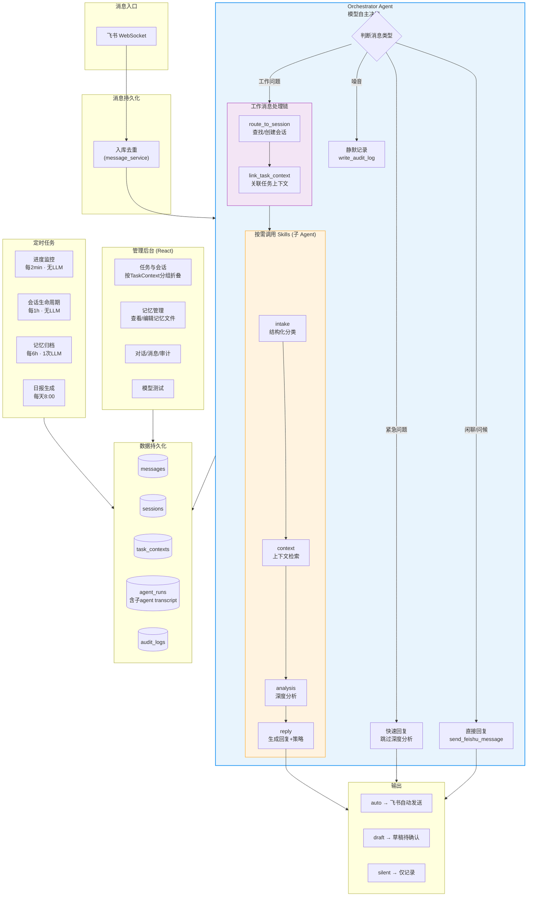

# Personal Work Agent OS

Local-first 个人工作助理系统。接入飞书，由 Orchestrator Agent 自主决策处理每条消息 — 分类、路由、分析、回复。依托 Claude Code Agent SDK，模型驱动的 Agentic 架构。

## 系统流程



## 核心能力

| 能力 | 实现方式 | 说明 |
|------|----------|------|
| 消息接入 | 飞书 WebSocket 长连接 | 私聊 + @机器人 |
| 自主决策 | Orchestrator Agent | 模型判断每条消息的处理路径 |
| 消息分类 | intake skill (子agent) | work/chat/noise/urgent/task_request |
| 上下文检索 | context skill (子agent) | 聚合最近消息+摘要+项目知识 |
| 深度分析 | analysis skill (子agent) | 结构化拆解工作问题 |
| 智能回复 | reply skill (子agent) | auto/draft/silent 三种策略 |
| 会话路由 | route_to_session MCP tool | 按 chat_id+项目+时间窗口匹配 |
| 任务关联 | link_task_context MCP tool | 模型判断会话归属哪个任务 |
| 子agent追踪 | SubagentStop hook | 子agent对话记录持久化到DB |
| 会话摘要 | 达阈值自动生成 | Markdown 格式 |
| 日报 | report skill | 从DB汇总，LLM润色 |
| 长期记忆 | memory consolidator | 定期归档会话知识 |
| 记忆管理 | 管理后台 Memory 页 | 查看/编辑 data/memory/ 文件 |
| Token追踪 | agent_runs 表 | 按agent/按天统计消耗 |

## 架构

```
.claude/agents/          子 Agent 定义（唯一定义源）
├── intake.md            消息分类
├── context.md           上下文检索
├── analysis.md          深度分析
├── reply.md             回复生成
└── report.md            日报生成

apps/
├── api/                 FastAPI 服务 + 管理 API
├── worker/
│   ├── feishu_worker    飞书 WebSocket 长连接
│   └── scheduler        定时任务（监控/日报/记忆）
└── admin-ui/            React + Vite 管理后台

core/
├── pipeline.py          Orchestrator Agent 入口（单入口，模型自主决策）
├── monitor.py           任务进度监控（纯 DB 查询）
├── connectors/
│   ├── feishu.py        飞书 SDK 封装
│   └── message_service  消息入库 + 触发 pipeline
├── sessions/
│   ├── router.py        会话路由（辅助模块）
│   ├── summary.py       会话摘要
│   └── lifecycle.py     生命周期管理
├── orchestrator/
│   ├── agent_client.py  Agent SDK 客户端 + MCP 工具
│   └── claude_client.py Claude API 客户端
├── reports/
│   └── daily.py         日报生成
└── memory/
    └── consolidator.py  长期记忆归档

skills/                  Skill 文档 + 辅助脚本
models/db.py             数据库模型
data/                    运行时数据（DB、摘要、记忆、日报）
scripts/                 初始化和迁移脚本
```

## 设计原则

1. **Agentic 单入口** — Orchestrator Agent 处理所有消息，模型自主决定调用哪些 skills
2. **依托 Runtime** — Claude Code Agent SDK 做执行器，子 agent 可以读文件、执行命令、查 DB
3. **文件是记忆，DB 是状态** — 摘要/日报/知识落文件，消息/路由/审计落 DB
4. **LLM 按需调用** — 定时任务中只有日报和记忆归档各调 1 次 LLM，进度监控纯 DB
5. **子 agent 可追溯** — SubagentStop hook 持久化 transcript，管理后台可查

## 快速开始

```bash
# 1. 安装依赖
pip install -e .

# 2. 配置环境变量
cp .env.example .env
# 编辑 .env 填入 FEISHU_APP_ID, FEISHU_APP_SECRET, ANTHROPIC_API_KEY

# 3. 初始化数据库
python scripts/init_db.py
python scripts/migrate_task_context.py

# 4. 启动服务
python -m apps.worker.feishu_worker  # 飞书消息接收
python -m apps.worker.scheduler      # 定时任务
python -m uvicorn apps.api.main:app --port 8000  # API 服务

# 5. 启动管理后台（开发模式）
cd apps/admin-ui && npm install && npm run dev
```

## API 端点

| 端点 | 说明 |
|------|------|
| `GET /api/conversations` | 对话记录（问答配对） |
| `GET /api/conversations/{chat_id}/history` | 聊天历史 |
| `GET /api/messages` | 原始消息列表 |
| `GET /api/sessions` | 工作会话列表 |
| `GET /api/sessions/{id}` | 会话详情 + 摘要 |
| `GET /api/task-contexts` | 任务上下文列表（含关联会话） |
| `GET /api/task-contexts/{id}` | 任务详情 |
| `GET /api/memory/files` | 记忆文件列表 |
| `GET/PUT/DELETE /api/memory/files/{path}` | 记忆文件 CRUD |
| `GET /api/token-usage` | Token 消耗统计 |
| `GET /api/pipeline/stats` | 管线状态统计 |
| `GET /api/agent/sessions/{sid}/transcript` | Agent 会话 transcript |
| `POST /api/messages/{id}/reprocess` | 重新处理消息 |
| `POST /api/reports/daily` | 手动生成日报 |
| `POST /api/memory/consolidate` | 手动触发记忆归档 |

## 定时任务

| 任务 | 频率 | LLM 调用 |
|------|------|---------|
| 进度监控 | 每 2 分钟 | 否 |
| 会话生命周期 | 每 1 小时 | 否 |
| 记忆归档 | 每 6 小时 | 1 次/批 |
| 日报 | 每天 8:00 | 1 次 |

## 现有不足与下阶段计划

### 问题分析

#### P0 — 架构缺陷（影响核心流程）

| 问题 | 现状 | 影响 |
|------|------|------|
| **每条消息独立处理，无多轮对话** | 每条飞书消息触发独立的 orchestrator agent 调用，上下文不连续 | 用户连续追问时 agent 不知道之前聊了什么 |
| **Agent SDK session 未复用** | 每次 `agent_client.run()` 创建新 session，不传 `session_id` 恢复 | 工具调用历史、推理上下文全部丢失 |
| **orchestrator 输出解析脆弱** | 依赖模型最终输出严格 JSON，但模型可能先输出文字再输出 JSON | 分类/session_id 等元数据提取失败率高 |
| **回复保存与发送分离** | orchestrator 通过 `send_feishu_message` tool 发送，但 pipeline 又自己 `_save_reply` | 可能出现已发送但未入库，或重复发送 |

#### P1 — 功能缺失（影响实用性）

| 问题 | 现状 | 影响 |
|------|------|------|
| **日报不推送** | `daily_report_job` 中 `push_to_feishu=False` 硬编码 | 日报只生成文件，不发飞书 |
| **飞书只支持纯文本** | `send_message` 发纯文本，不支持卡片/Markdown | 回复格式差，没有结构化展示 |
| **记忆归档仍用 claude_client.chat** | `consolidator.py` 直接调 Claude API，没走 agent 架构 | 与 agentic 架构不一致，且无法用工具 |
| **会话摘要仍用 claude_client.chat** | `summary.py` 直接调 Claude API | 同上 |
| **管理后台无搜索/筛选** | 消息/会话列表只有分页，无搜索 | 数据多了以后找不到东西 |
| **无错误恢复机制** | agent 调用失败后只记录错误，不重试 | 偶发的 API 超时导致消息永久失败 |

#### P2 — 运维缺陷

| 问题 | 现状 | 影响 |
|------|------|------|
| **三个进程独立启动** | feishu_worker、scheduler、API 分别启动 | 运维复杂，容易漏启 |
| **无健康检查** | API 没有 `/health` 端点 | 无法做进程守护和监控 |
| **Token 消耗无告警** | 只记录不告警 | 模型异常循环时烧钱无感知 |
| **无数据备份** | SQLite 文件无自动备份 | 数据丢失风险 |

---

### 下阶段计划

#### Phase 6: 多轮对话与 Agent Session 管理

**目标**: 解决 P0 问题，让 orchestrator 能在同一个 Agent SDK session 中持续对话。

- [ ] 将 DB session 与 Agent SDK session 绑定（sessions 表加 `agent_session_id` 字段）
- [ ] 消息路由到已有 session 时，用 `resume=agent_session_id` 恢复 agent 上下文
- [ ] 新 session 首次创建 agent session，后续消息 resume 同一个
- [ ] orchestrator 元数据（分类、session_id）改为通过 MCP tool 写入，不依赖输出 JSON 解析
- [ ] 新增 `save_bot_reply` MCP tool，让 agent 自己保存回复到 DB，避免 pipeline 重复处理

#### Phase 7: 飞书消息增强

**目标**: 提升消息展示质量和接入能力。

- [ ] 支持飞书卡片消息（Interactive Card）回复
- [ ] 回复中区分：正文、分析过程、风险提示（用卡片分块展示）
- [ ] 支持图片/文件消息接收（存储到 data/files/，内容描述传给 agent）
- [ ] 日报推送 chat_id 从配置/记忆读取，启用自动推送
- [ ] 草稿消息支持飞书卡片确认按钮（approve/reject）

#### Phase 8: 管理后台增强

**目标**: 让管理后台真正可用。

- [ ] 消息/会话列表增加搜索（关键词、发送者、时间范围）
- [ ] Dashboard 增加 Token 消耗折线图（按天）
- [ ] Dashboard 增加消息分类饼图
- [ ] 任务上下文详情页：展开每个 session 的完整对话流
- [ ] 手动修正消息分类和会话归属
- [ ] 日报预览和在线编辑

#### Phase 9: 稳定性与运维

**目标**: 生产可用。

- [ ] Docker Compose 一键部署（feishu_worker + scheduler + API + admin-ui）
- [ ] API 增加 `/health` 端点（检查 DB 连接 + 飞书 WS 状态）
- [ ] Token 消耗日预算告警（超阈值飞书推送）
- [ ] pipeline 失败自动重试（指数退避，最多 3 次）
- [ ] SQLite 每日自动备份到 data/backup/
- [ ] 日志轮转配置
